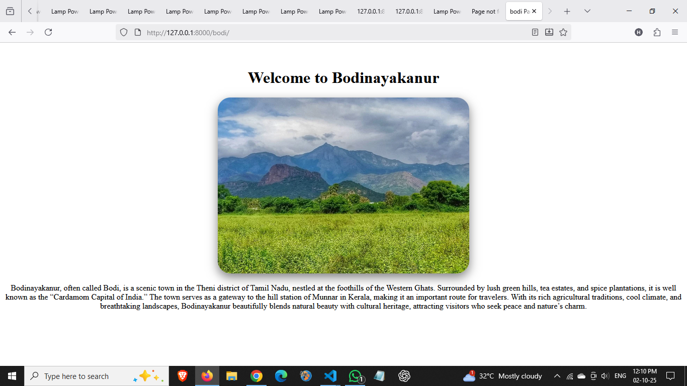
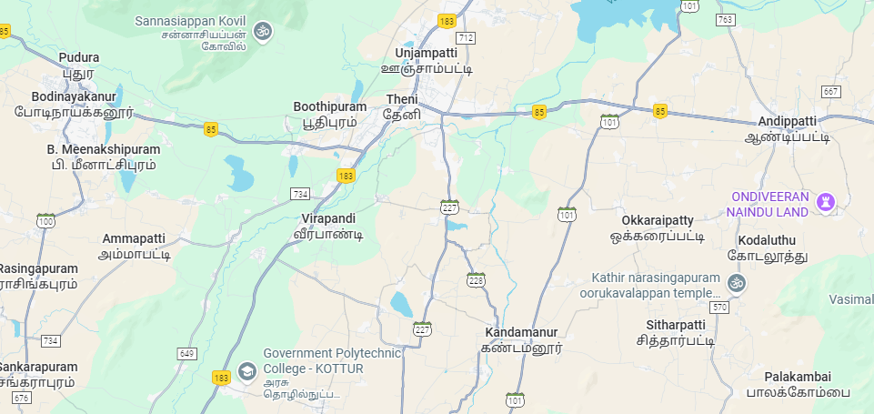

# Ex04 Places Around Me
# Date:2.10.2025
# AIM
To develop a website to display details about the places around my house.

# DESIGN STEPS
## STEP 1
Create a Django admin interface.

## STEP 2
Download your city map from Google.

## STEP 3
Using <map> tag name the map.

## STEP 4
Create clickable regions in the image using <area> tag.

## STEP 5
Write HTML programs for all the regions identified.

## STEP 6
Execute the programs and publish them.

# CODE 
```


<!DOCTYPE html>
<html lang="en">
    <head>
       <title>THENI</title>
       
        
    </head>

     <body>
        <center></center>
        <map name="THENI">


    <area shape="rect" coords="593,144,504,120" title="Theni" href="">

    <area shape="rect" coords="174,124,15,140" title="Bodinayakanur" href="" name="bodi.html">
 
    
    <area shape="rect" coords="423,150,469,100" title="Boothipuram" href="" name="boothi.html">

    <area shape="rect" coords="293,209,179,242" title="Meenachipuram" href="" name="meena.html">

    <area shape="rect" coords="530,223,418,382" title="Virapandi" href="" name="virapandi.html">
  

        </map>  
        </body>
</html>

 views.py:
 
from django.shortcuts import render

def img_view(request):
    return render(request, 'img.html')

def bodi(request):
    return render(request,'bodi.html')

def vira(request):
    return render(request, 'virapandi.html') 

def boothi(request):
    return render (request, 'boothi.html')


def meena(request):
    return render (request, 'meenachipuram.html')

urls.py :

from django.contrib import admin
from django.urls import path
from imgapp import views

urlpatterns = [
    path('admin/', admin.site.urls),
    path('', views.img_view),
    path('bodi/',views.bodi,name='bodi'),
    path('vira/',views.vira,name='virapandi'),
    path('boothi/',views.boothi,name='boothi'),
    path('meena/',views.meena,name='meena')
]


```
# OUTPUT

.png>)

.png>)

.png>)





# RESULT
The program for implementing image maps using HTML is executed successfully.
